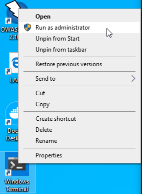
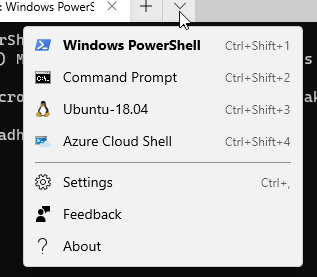
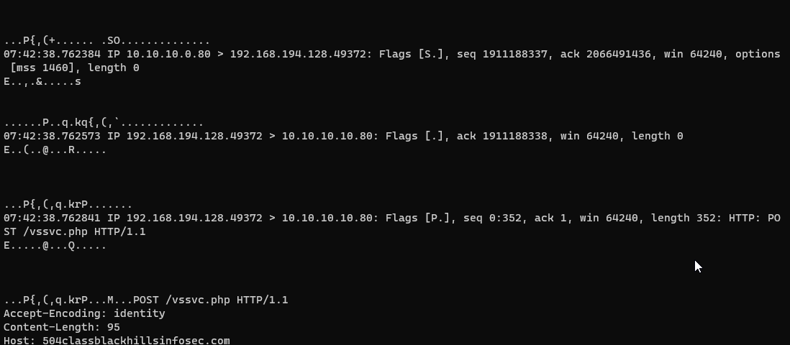

 

# Advanced C2 PCAP Analysis 

  

First, we will need to open the Ubuntu Terminal. 

  

Simply right-click on the Windows Terminal Icon and select Run as Administrator 

  

 

  

Next, open an Ubuntu Prompt by clicking the down carrot in the terminal and selection Ubuntu. 

  

 

  

Next, let's navigate to the directory where the pcap file is stored. 

  

`cd /opt/covert` 

  

It should look like this: 

  

 

  

Next, we will run some tcpdump commands to analyze the pcap file. 

  

`sudo tcpdump -nA -r covertC2.pcap | less` 

  

The –nA option tells tcpdump not to resolve names (n) and print the ASCII text of the packet (A). You are reading in a file with the (-r) option and piping the data ( | ) through less so you can view it section by section.  

  

It should look like this: 

  

 

  

Hit spacebar till you see a line with VIEWSTATE in it. 

  

It should look like this: 

  

 

  

Press `q` to close the tcpdump session. 

  

One of the interesting things about many malware specimens we review these days is how they “wait” for the attacker to communicate with them. For example, in the sample malware traffic we are reviewing, the backdoor “beacons” out every 30 seconds. This is for two reasons. One is because the attacker might not be at a system waiting for a command shell on a compromised target and. Secondly, because long-term established sessions tend to attract attention. This is because with protocols such as HTTP, the sessions are generally short burst sessions for multiple objects. When this backdoor was created, we wanted it to act like real HTTP. So, it had to have an asynchronous component to it.  
  

In the capture, the SYN packets are roughly 30 seconds apart for the beacon traffic.  

  

To see the SYN packets, simply run the following command:  

  

`sudo tcpdump -r covertC2.pcap 'tcp[13] = 0x02'` 

  

It should look like this: 

  

 

  

This filter shows all packets with the SYN bit (0x02) set in the 13th byte offset in the TCP/IP header (tcp[13]).  

  

  

Note the time difference between the packets. You can see at the beginning that they are 30 seconds apart.  

  

Run the following command to grep any other instances of “hidden”:  

  

`sudo tcpdump -nA -r covertC2.pcap | grep "hidden"` 

  

It should look like this: 

  

 

  

You should see a number of returned lines. If you look at these values, you see what appears to be random data followed by an = sign. This could mean it is Base64 encoded data. Does this mean it is evil? Not necessarily. It just means it is interesting.  

  

However, you can quickly prove or disprove this hypothesis by using Python to decode the data. If it is Base64, it will decode, and you will see ASCII characters. If not, you will keep looking.  

  

Either way, it is a fun opportunity to play with Python. 

  

Well now, when you look at the VIEWSTATE parameters, you can see they are not consistent.  

  

You can also see that it appears to be Base64 encoded.  

  

  

Now for a challenge. What is this Base64 encoded data? 

  

  

Here is one solution, 

  

 

  

When you do this, you can quickly see that the Base64 encoded data is a PowerShell command to download and execute Powersploit, which then invokes a Metasploit Meterpreter on the system.  

  

Attackers can also pseudo-randomly include extra characters designed to break automated decoding. This is a remarkably simple, yet effective, technique that then requires a responder to manually find and remove the ever-changing characters in order to decode the communications. 

  

  

  

  

  

  

 

 
